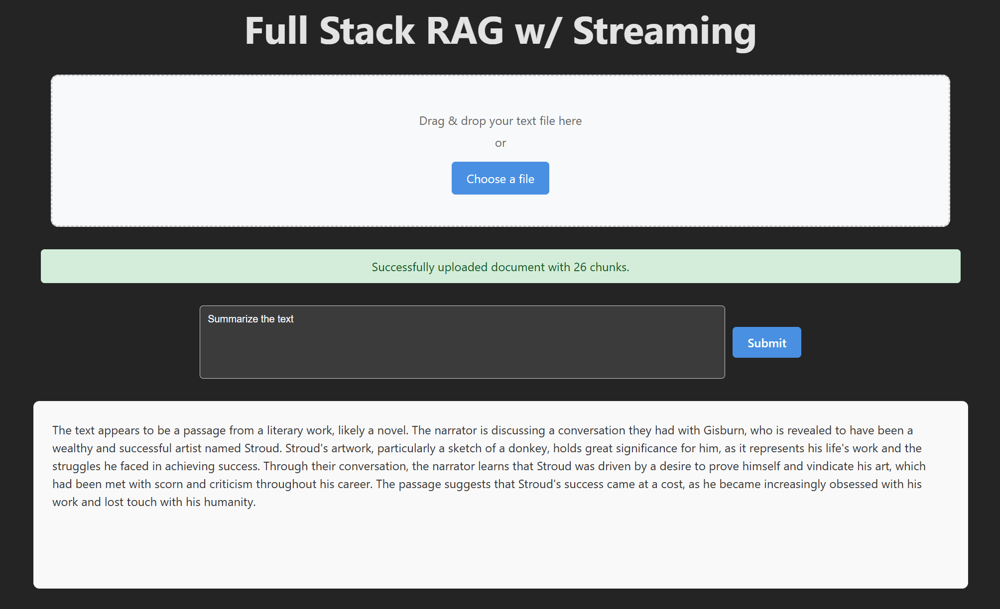
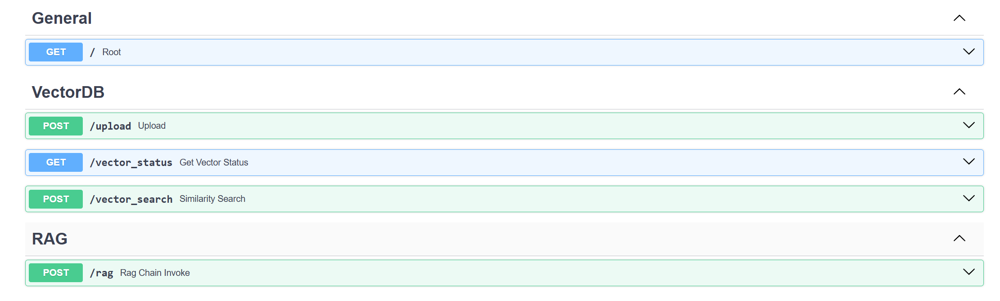

# Simple RAG Fullstack Application

This project demonstrates a simple Retrieval-Augmented Generation (RAG) fullstack application. It consists of a Python backend (FastAPI) for RAG functionalities and a Vite-based React frontend for user interaction. The application leverages Ollama for running large language models locally.

## Table of Contents

- [Features](#features)
- [Screenshots](#screenshots)
- [Project Structure](#project-structure)
- [Prerequisites](#prerequisites)
- [Project Setup](#project-setup)
  - [1. Install Ollama and Download Models](#1-install-ollama-and-download-models)
  - [2. Backend Setup](#2-backend-setup)
  - [3. Frontend Setup](#3-frontend-setup)
  - [4. Running the Application](#4-running-the-application)
- [License](#license)

## Features

- Full-stack RAG application
- FastAPI backend
- React (Vite) frontend
- Local LLM inference via Ollama
- Document ingestion and retrieval
- Question answering based on ingested documents

## Screenshots


## Project Structure
.
├── LICENSE
├── README.md
├── backend
│   ├── RAGChain.py
│   ├── main.py
│   └── vectorizer.py
├── frontend
│   ├── eslint.config.js
│   ├── index.html
│   ├── package-lock.json
│   ├── package.json
│   ├── public
│   │   └── vite.svg
│   ├── src
│   │   ├── App.css
│   │   ├── App.tsx
│   │   ├── assets
│   │   │   └── react.svg
│   │   ├── index.css
│   │   ├── main.tsx
│   │   └── vite-env.d.ts
│   ├── tsconfig.app.json
│   ├── tsconfig.json
│   ├── tsconfig.node.json
│   └── vite.config.ts
└── requirements.txt


## Prerequisites

Before setting up the project, ensure you have the following installed on your system:

* **Git:** For cloning the repository.
* **Python 3.9+:** For the backend. (Specify a minimum version if necessary, e.g., 3.9, 3.10, etc.)
* **Node.js & npm (or yarn):** For the frontend. (Node.js 18+ and npm 8+ are generally recommended for modern React/Vite apps).
* **Ollama:** The local LLM server.

## Project Setup

Follow these steps to get the application running on your local machine.

### 1. Install Ollama and Download Models

First, you need to install Ollama and download the necessary models that your backend will use.

1.  **Install Ollama:**
    Follow the official installation instructions for your operating system: [https://ollama.com/download](https://ollama.com/download)

    * **For Linux/WSL:** You can typically use `curl -fsSL https://ollama.com/install.sh | sh`
    * **For macOS:** Download the application and install.
    * **For Windows:** Download the installer and run it.

2.  **Start Ollama:**
    Ensure the Ollama server is running. On most systems, it starts automatically after installation. You can verify it by running `ollama serve` in your terminal. If it's already running in the background, this command will tell you.

3.  **Download Required Models:**
    Open your terminal and run the following commands to download the models:

    ```bash
    ollama run llama3.2:latest
    # Wait for the download to complete, then you can exit by typing 'bye' or Ctrl+D
    ollama run mxbai-embed-large
    # Wait for the download to complete, then you can exit by typing 'bye' or Ctrl+D
    ```
    These commands will download the models if they are not already present on your system.

### 2. Backend Setup

1.  **Clone the repository:**

    ```bash
    git clone [https://github.com/your-username/Simple_RAG_Fullstack.git](https://github.com/your-username/Simple_RAG_Fullstack.git)
    cd Simple_RAG_Fullstack
    ```

2.  **Navigate to the backend directory:**

    ```bash
    cd backend
    ```

3.  **Create and activate a Python virtual environment:**

    ```bash
    python3 -m venv venv
    source venv/bin/activate  # On Windows, use `.\venv\Scripts\activate`
    ```

4.  **Install backend dependencies:**

    ```bash
    pip install -r requirements.txt
    ```

    *(Self-correction: I've included the `requirements.txt` content for completeness, but the user provides it, so it's just a placeholder here.)*
    **`requirements.txt` content:**
    ```
    fastapi==0.115.9
    uvicorn==0.34.2
    langchain==0.3.25
    langchain_community==0.3.23
    langchain_chroma==0.2.4
    langchain_core==0.3.60
    langchain_ollama==0.3.3
    langchain_text_splitters==0.3.8
    pydantic==2.11.4
    python-dotenv==1.1.0
    FlashRank==0.2.10
    ```

5.  **Run the backend server:**

    ```bash
    uvicorn main:app --reload
    ```
    The backend server will typically run on `http://0.0.0.0:8000` or `http://localhost:8000`. You can test it by visiting `http://localhost:8000/docs` in your browser.

### 3. Frontend Setup

1.  **Navigate to the frontend directory (in a new terminal tab/window):**

    ```bash
    cd Simple_RAG_Fullstack/frontend
    ```

2.  **Install frontend dependencies:**

    ```bash
    npm install
    # Or if you use yarn:
    # yarn install
    ```

3.  **Run the frontend development server:**

    ```bash
    npm run dev
    # Or if you use yarn:
    # yarn dev
    ```
    The frontend application will typically run on `http://localhost:5173` (Vite's default port, or another available port).

### 4. Running the Application

* Ensure **Ollama is running** in the background.
* Keep the **backend server running** (from step 2.5).
* Keep the **frontend development server running** (from step 3.3).

You should now be able to access the full application by opening your web browser to the frontend's address (e.g., `http://localhost:5173`).

---

